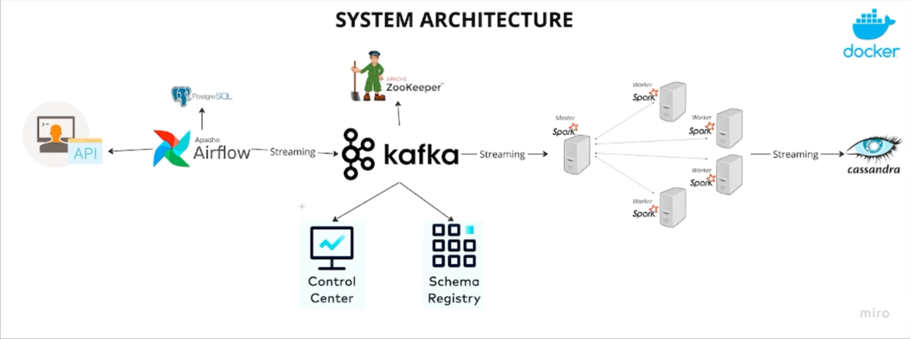
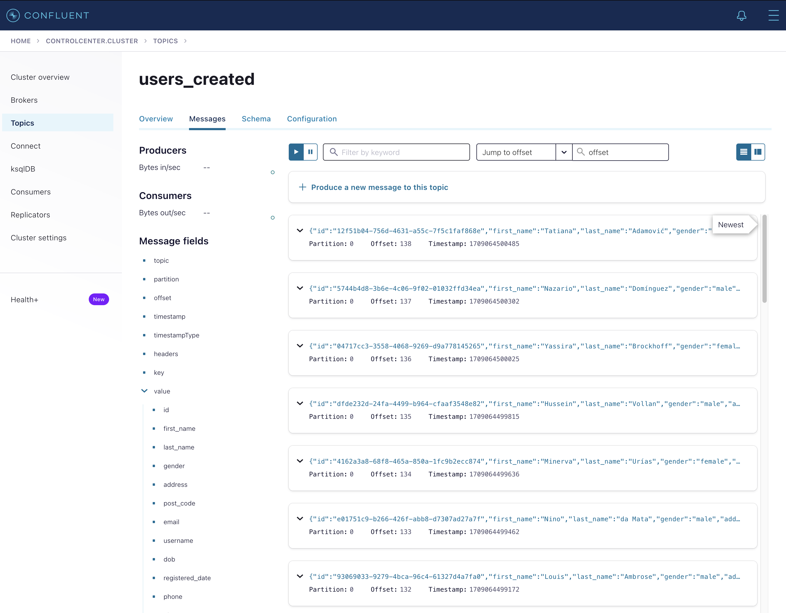
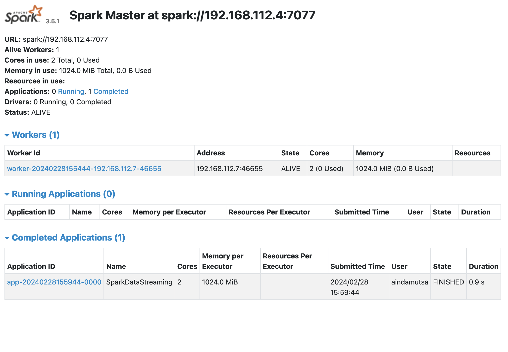
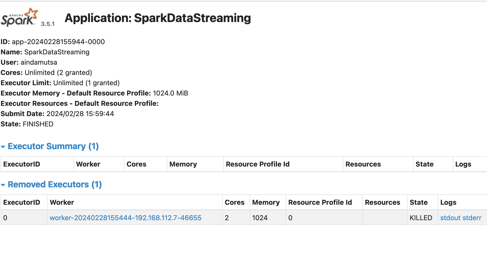
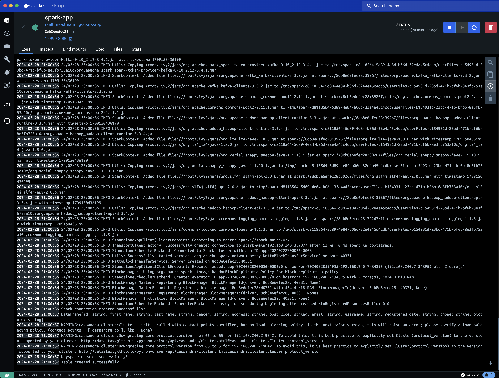
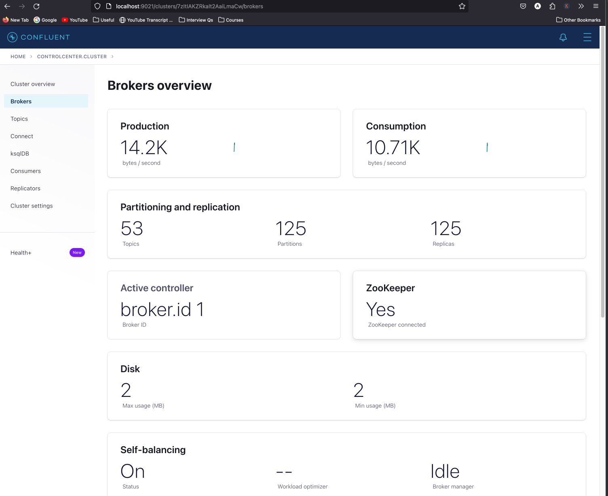
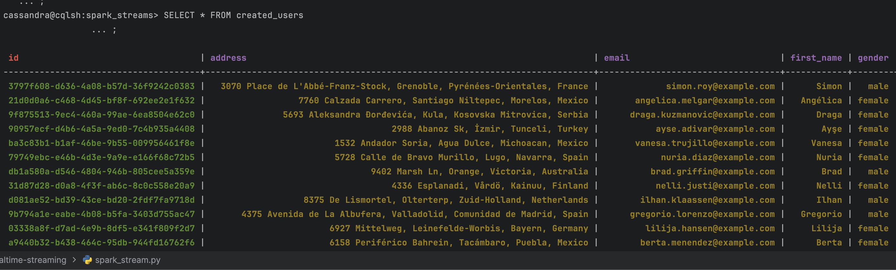
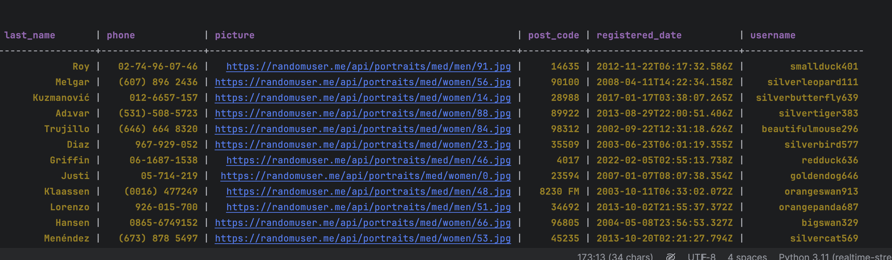

# Realtime Data Streaming and Processing

## Overview

This project outlines a robust real-time data streaming architecture that integrates a suite of open-source technologies for efficient data ingestion, processing, and analytics. The system's design allows for handling large volumes of data with high throughput and low latency, ensuring scalability and resilience.

## System Architecture



### Data Ingestion:

- **API**: The entry point for real-time data. The data can come from multiple sources, such as IoT devices, web applications, or other external systems.

### Workflow Orchestration:

- **Apache Airflow**: Used to manage and orchestrate complex workflows, ensuring that tasks are scheduled, executed, and monitored efficiently.

### Message Queuing:

- **Apache Kafka**: Serves as the central nervous system for data streams, providing a distributed and fault-tolerant messaging system that efficiently processes data in real-time.



### Data Processing:

- **Apache Spark**: A powerful engine for large-scale data processing, capable of handling streaming data to perform real-time analytics.




The cluster can be initiated in docker compose using the following command:

```shell
docker-compose up -d
```

You may have to keep an eye on spark-app container as it is the one reading the topics from kafka and writing to cassandra. You can check the logs using the following command:

```shell
docker logs -f spark-app
```

Or by using docker desktop to check the logs of the container.



Spark cluster can be initiated to write data to Cassandra using the following command:

```shell
python spark_stream.py
```

or commenting out the code that write to cassandra inside the spark_stream.py and running the following command:

```shell
spark-submit --master spark://localhost:7077 \
--packages com.datastax.spark:spark-cassandra-connector_2.12:3.4.1,org.apache.spark:spark-sql-kafka-0-10_2.12:3.4.1 \
spark_stream.py
```

### Data Storage:

- **Apache Cassandra**: A highly scalable NoSQL database, perfect for managing large datasets with fast read and write capabilities.

### Supporting Services:

- **PostgreSQL**: Utilized for structured data storage, possibly for storing metadata or as a backend for Airflow's configuration and state management.

- **Apache ZooKeeper**: Manages and coordinates Kafka brokers, ensuring high availability and consistency across the distributed system.

### Schema Management:

- **Control Center & Schema Registry**: Provides a user interface for managing Kafka clusters and a repository for maintaining consistent data schemas, essential for ensuring data compatibility and integrity across services. We will be able to monitor and manage Kafka clusters and topics using the Control Center UI. The registry will store and manage Avro schemas for Kafka topics.



### Containerization:

- **Docker**: The entire system is containerized, indicating that each component runs in a separate container for improved scalability and ease of deployment.

## Getting Started

To begin using this architecture for your real-time data streaming needs, follow these steps:

1. **Setup and Configuration**

   - Install Docker and Docker Compose to manage containers.
   - Set up Apache Airflow to orchestrate your data workflows.
   - Configure Apache Kafka for message queuing and stream processing.
   - Initialize Apache Cassandra for your NoSQL data storage requirements.
   - Set up PostgreSQL for structured data storage and Airflow backend.
   - Configure Apache ZooKeeper to manage your Kafka cluster.
   - Install and configure the Control Center and Schema Registry for Kafka.

2. **Run the System**

   - Use Docker Compose to bring up the entire architecture with a single command.
   - Monitor the system using the Control Center UI.
   - Ensure all services are interconnected on the same Docker network.
   - Verify that data is flowing through the system as expected.

   ```bash
   docker-compose up -d # to run it in detached mode
   ```

   - To stop the system, run the following command:

   ```shell
   docker-compose down -v # Zookeeper complains if you don't remove the volumes
   ```

   Verify that Cassandra is getting data from the Kafka topic by running the following command:

   ```shell
   docker exec -it cassandra cqlsh -u cassandra -p cassandra localhost 9042
   ```

   To interact with cassandra, you can use the following commands:

   ```sh
   # List all keyspaces
   DESCRIBE KEYSPACES;

   # Describe the keyspace, SQL Object that represents database in alternative to database in RDBMS
   DESCRIBE spark_streams.created_users; #OR DESC KEYSPACE mykeyspace;

   # Connect to the keyspace
   use spark_streams;

   # List all tables in the keyspace
   DESCRIBE TABLES;

   # Describe the table
   # DESC TABLE created_users;

   # Select all data from the table
   SELECT * FROM created_users;
   ```




3. **Deployment**

- For now, the system is deployed locally using Docker Compose. However, you can deploy it to a cloud provider or on-premises infrastructure.

4. **Monitoring and Management**

- Use Airflow's UI to monitor and manage workflow tasks.
- Leverage Kafka's Control Center for real-time monitoring of data streams.
- Regularly back up your Cassandra and PostgreSQL databases.

## Contributing

Your contributions are welcome! Fork the repository, make your changes, and submit a pull request. We will review your changes and work together to get them merged into the main branch. My email is open for any questions or feedback.

For more information:

- [Apache Spark with Kafka Integration](https://spark.apache.org/docs/latest/structured-streaming-kafka-integration.html)
- [Apache Cassandra Documentation](https://cassandra.apache.org/doc/latest/)
- [Apache Kafka Documentation](https://kafka.apache.org/documentation/)
- [Apache Airflow Documentation](https://airflow.apache.org/docs/apache-airflow/stable/index.html)

These maven repositories are used in the project:

- [Spark cassandra connector](spark-cassandra-connector_2.13)
- [Spark SQL Kafka](https://mvnrepository.com/artifact/org.apache.spark/spark-sql-kafka-0-10_2.13/3.5.1)

```

```
